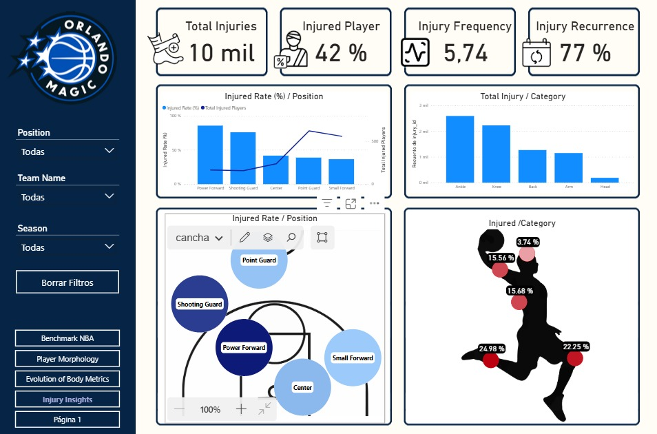
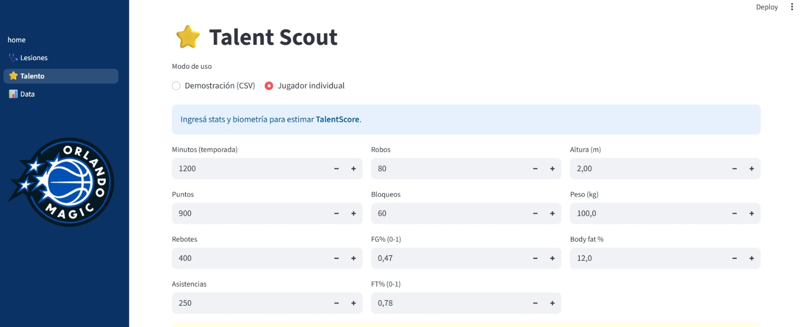

# 🏀 NBA – Composición Corporal, Rendimiento y Lesiones

Proyecto colaborativo **LEG Analytics** – Data Analytics Bootcamp.  
Análisis integral de la NBA para relacionar **composición corporal**, **rendimiento deportivo** y **lesiones**.

<!-- Banner -->
  
*(Banner con el título del proyecto + logos NBA/Orlando Magic. Tamaño recomendado: 1200×300 px)*

## 📌 Contexto
**Cliente:** Departamento *Player Performance & Sports Science* de **Orlando Magic (NBA)**.  
**Misión:** Optimizar el desarrollo físico, reducir el riesgo de lesiones y mejorar la preparación integral.

---

## 🎯 Objetivos
- Identificar perfiles físicos óptimos por posición y estilo de juego.  
- Relacionar composición corporal y morfología con rendimiento en cancha.  
- Detectar métricas clave para anticipar desempeño.  
- Predecir riesgos de lesiones mediante análisis de datos.  
- Construir un dashboard y una app interactiva con KPIs clave para la toma de decisiones.

## 🔄 Pipeline de trabajo

  
*(Flujo: `Datasets → Limpieza/Transformación → SQL Modelo Estrella → Dashboard Power BI + App Streamlit`)*

1. **Datasets originales** (`/data_raw/`)  
   - common_player_info  
   - draft_combine_info  
   - game_info  
   - NBA_PLAYER_DATASET  
   - NBA_Player_Injury  

2. **Limpieza y transformación** (`/notebooks/` + `/docs/cleaning_reports/`)  
   - Notebooks de limpieza (Python)  
   - Reportes de documentación  

3. **Modelo Estrella en SQL Server** (`/sql/`)  
   - Tablas `dim` y `fact`  
   - Relaciones PK/FK  
   - Script MER global  

4. **Dashboard Power BI** (`/dashboards/`)  
   - KPIs de composición corporal, rendimiento y lesiones  
   - Filtros por equipo, temporada y posición  

5. **App en Streamlit** (`/app/`)  
   - Integración de datos SQL y CSV  
   - Modelos predictivos de lesiones y talento  
   - Validación de datasets y auditoría de información

---

## 📂 Estructura del repositorio
/data_raw/ → datasets originales
/data_clean/EDA_exploratorio/ → datasets limpios iniciales
/data_clean/EDA_profundo/ → datasets modelados (dim y fact)
/sql/ → scripts SQL del modelo estrella
/sql/keys/ → llaves PK/FK y constraints
/notebooks/ → notebooks de limpieza y análisis, código de la app Streamlit.
/dashboards/ → dashboard Power BI y capturas
/docs/ → documentación del proyecto, diccionario de datos
/docs/cleaning_reports/ → reportes de profiling y limpieza
/docs/img/ → imágenes (banner, pipeline, MER, dashboard)

## 📑 Recursos principales

### 🧹 Limpieza de datos
- [Notebooks de limpieza](./notebooks/)  
- [Cleaning reports](./docs/cleaning_reports/)  

### 🗄️ Modelo Estrella (SQL)
- [00_MER_DATABASE_ORLANDOMAGIC.sql](./sql/00_MER_DATABASE_ORLANDOMAGIC.sql)  
- [01_dim_player_team.sql](./sql/01_dim_player_team.sql)  
- [02_fact_combine.sql](./sql/02_fact_combine.sql)  
- [03_fact_game.sql](./sql/03_fact_game.sql)  
- [04_fact_injuries.sql](./sql/04_fact_injuries.sql)  
- [05_fact_player_stats.sql](./sql/05_fact_player_stats.sql)  
- [06_dim_date.sql](./sql/dim_date.sql)  

## 🗺 Modelo Estrella

  
*(Diagrama estrella con dim_player, dim_team, dim_date, dim_season, fact_game, fact_player_stats, fact_combine, fact_injuries)*

---

## 📊 Dashboard Power BI

  
*(KPIs principales: equipos, jugadores, temporadas. Promedio de peso y altura por posición)*

  
*(KPIs principales: Lesiones, frecuencia y recurrencia)*

  
*(KPIs principales: evolución temporal de altura, peso, masa grasa y masa muscular)*

> ℹ️ Para ver el dashboard completo: [docs/dashboard_completo.pdf](docs/dashboard_completo.pdf)

## 🌐 App en Streamlit
La plataforma está construida en **Streamlit**, integrando diferentes bases de datos históricas y combinando estadísticas de juego, variables físicas y registros de lesiones. Convierte información dispersa en herramientas predictivas claras y visuales.

  
*(Vista de la app Streamlit — sección **Talento**: ranking de jugadores con Talent Score para scouting)*

### Secciones principales
- **Home:** validación de carga de datasets para garantizar integridad de datos.  
- **Lesiones:** modelo de clasificación con **probabilidad de lesión**. Umbral ajustable (threshold) que prioriza el *recall* para minimizar falsos negativos y prevenir lesiones.  
- **Talento:** modelo de regresión que genera un **Talent Score**, ordenando jugadores según su potencial (ranking objetivo para scouting).  
- **Data:** exploración y auditoría del dataset maestro, con filtros por temporada, posición o minutos jugados.  

### Beneficios para Orlando Magic
- Prevenir lesiones mediante la detección temprana de riesgos.  
- Optimizar el scouting con un ranking claro de talentos emergentes.  
- Tomar decisiones basadas en evidencia, combinando ciencia deportiva y análisis de datos.  

## 👥 Equipo

- **Lorena Maza** https://www.linkedin.com/in/lorena-maza/
- **Eliana Olmedo** 
- **Guillermo Morrone** 

## 📚 Referencias y licencia
- Fórmula Deurenberg (1991) para estimación de % de masa grasa.  
- Bibliografía y enlaces a datasets originales.  

